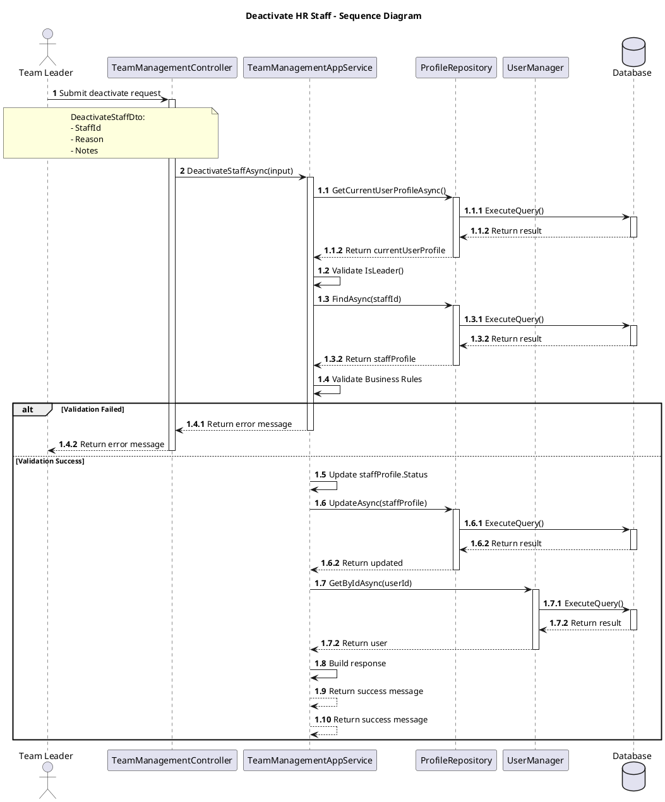
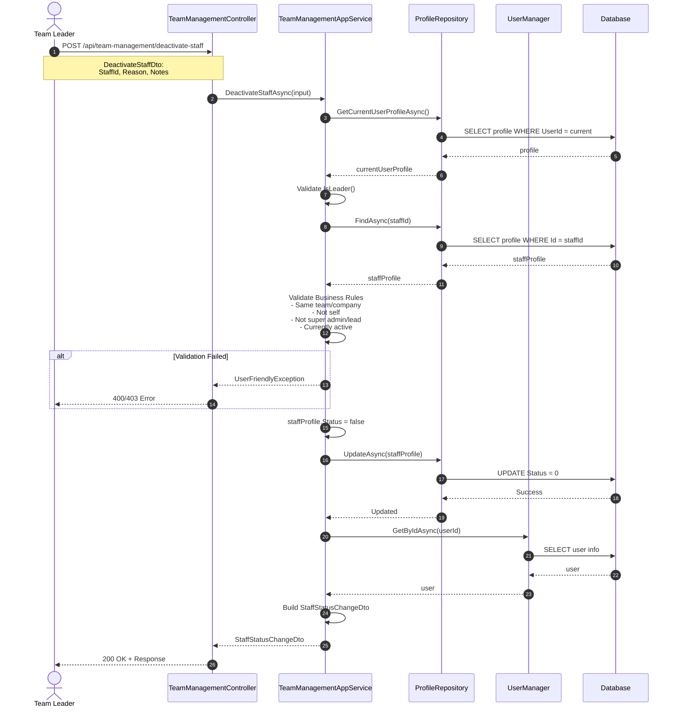

# Sequence Diagram - Deactivate HR Staff (Simple Version for Visual Paradigm)

## Mô tả
Sequence Diagram đơn giản mô tả luồng chính khi Team Leader deactivate một HR Staff member.

## PlantUML Diagram (với đánh số phân cấp)



## Mermaid Diagram (backup)



## Hệ thống đánh số phân cấp (Sequence Numbering)

| Số | Mô tả | Layer |
|---|---|---|
| **1** | Submit deactivate request | Leader → API |
| **2** | DeactivateStaffAsync(input) | API → Service |
| **1.1** | GetCurrentUserProfileAsync() | Service → Repository |
| **1.1.1** | ExecuteQuery() | Repository → DB |
| **1.1.1** | Return result | DB → Repository |
| **1.1.2** | Return currentUserProfile | Repository → Service |
| **1.2** | Validate IsLeader() | Service internal |
| **1.3** | FindAsync(staffId) | Service → Repository |
| **1.3.1** | ExecuteQuery() | Repository → DB |
| **1.3.1** | Return result | DB → Repository |
| **1.3.2** | Return staffProfile | Repository → Service |
| **1.4** | Validate Business Rules | Service internal |
| **1.4.1** | Return error message (if failed) | Service → API |
| **1.4.2** | Return error message | API → Leader |
| **1.5** | Update staffProfile.Status | Service internal |
| **1.6** | UpdateAsync(staffProfile) | Service → Repository |
| **1.6.1** | ExecuteQuery() | Repository → DB |
| **1.6.1** | Return result | DB → Repository |
| **1.6.2** | Return updated | Repository → Service |
| **1.7** | GetByIdAsync(userId) | Service → UserManager |
| **1.7.1** | ExecuteQuery() | UserManager → DB |
| **1.7.1** | Return result | DB → UserManager |
| **1.7.2** | Return user | UserManager → Service |
| **1.8** | Build response | Service internal |
| **1.9** | Return success message | Service → API |
| **1.10** | Return success message | API → Leader |

### Quy tắc đánh số:
- **1, 2, 3...**: Messages chính giữa các components
- **1.x**: Sub-operations trong Service layer
- **1.x.y**: Database operations và returns

### Activation Boxes (Lifelines):
- **activate**: Bắt đầu activation (component đang xử lý)
- **return**: Tự động deactivate và trả về response (tạo khoảng "đứt" trong activation box)
- Component chỉ active khi đang xử lý, khi return thì deactivate
- Khi Service gọi Repository, activation box của Service vẫn tiếp tục nhưng "nhường chỗ" cho Repository

## Luồng chính

### 1. Request
```json
POST /api/team-management/deactivate-staff
{
  "staffId": "guid",
  "reason": "Performance issues",
  "sendNotification": true
}
```

### 2. Validation Steps
1. **Get Current User Profile** (1.1): Lấy thông tin profile của leader từ database
2. **Check Leader Permission** (1.2): Kiểm tra có phải leader không
3. **Get Staff Profile** (1.3): Lấy thông tin staff cần deactivate từ database
4. **Business Rules Validation** (1.4):
   - Cùng department/company
   - Không tự deactivate mình
   - Không deactivate super admin/lead
   - Staff đang active

### 3. Update Operation (Success flow)
1. **Update Status** (1.5): Set `Status = false`
2. **Save to Database** (1.6): UpdateAsync và ExecuteQuery
3. **Get User Info** (1.7): Lấy thông tin user để trả về response
4. **Build Response** (1.8): Tạo StaffStatusChangeDto

### 4. Response
```json
{
  "staffId": "guid",
  "fullName": "Name",
  "email": "email@example.com",
  "previousStatus": true,
  "newStatus": false,
  "action": "Deactivate",
  "reason": "Performance issues",
  "changeTimestamp": "2025-10-28T08:30:15Z",
  "performedBy": "leader@example.com"
}
```

## Error Cases

| Error | HTTP Code | Message |
|-------|-----------|---------|
| Not a leader | 403 | Only team leaders can deactivate staff |
| Self-deactivation | 400 | Cannot deactivate yourself |
| Already inactive | 400 | Staff member is already inactive |
| Different team | 404 | Staff not found or not in your team |
| Super admin/Lead | 403 | Cannot deactivate super admin/lead |


